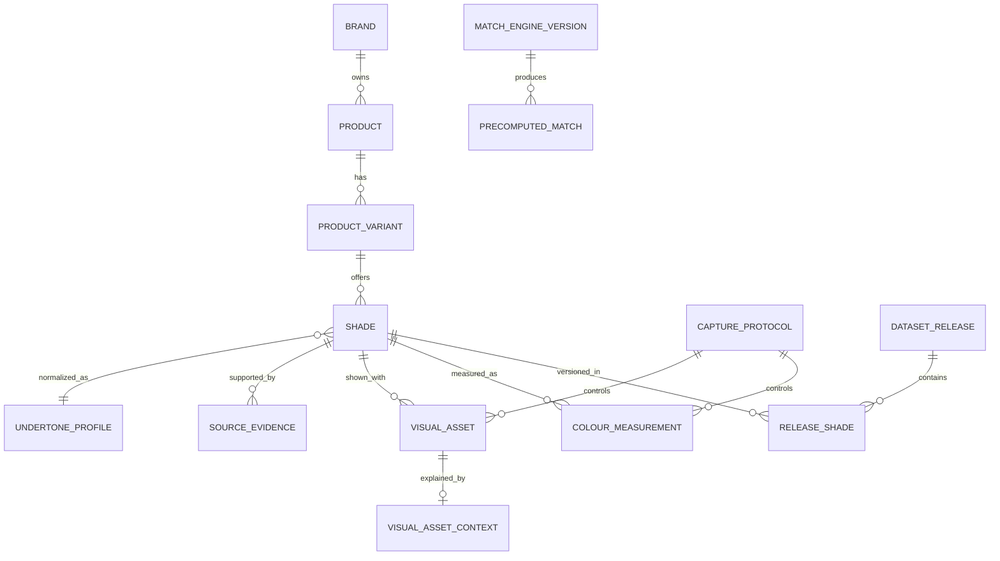

# ShadeMatch Global — Revised Flutter and Data Handoff

## 1. Outcome

The app is buildable as a single Flutter codebase for iOS and Android, but the old website data model cannot support trustworthy visual shade matching. The revised design makes visual references, colour measurements, evidence strength, rights, regional formula variants, and match-engine versions first-class data.

The immediate Flutter seed displays a clear colour chip for all 1,578 shade records. Every current chip is labeled as a generated universal-profile sample because the source workbook has no official image URLs, licensed image files, calibrated swatches, or laboratory colour values. The app must never disguise those generated chips as the actual product colour.

## 2. Audit of the inherited package

### Existing strengths

- 1,578 shade records across 34 populated brands.
- Manufacturer product-page URLs and verification dates are retained.
- D01–D30 universal depth and broad undertone normalization are available.
- Current, retiring, and legacy product statuses are distinguished.
- The worldwide directory can list brands before their shade-level data is verified.

### Build-blocking gaps

| Gap | Consequence | Revision |
|---|---|---|
| No image, swatch, hex, Lab, or asset fields | The website can only show text | Add `visual_assets` and `colour_measurements` |
| No distinction between visual types | A generated colour could appear as authoritative | Add evidence kind, tier, verification, match eligibility, and user label |
| Product and regional formula are one string | Same shade code can silently refer to different formulas or markets | Separate `products`, `product_variants`, and `shades` |
| No asset rights or attribution | Images cannot be safely redistributed | Add rights status, licence reference, attribution, source, and withdrawal state |
| Coarse depth/undertone score only | Equal-profile ties are arbitrary and distant shades can be returned | Add evidence-aware scoring, hard distance limits, deterministic tie-breaking, and engine versions |
| Undertone logic uses the first character | Compound codes such as `WN`, `CN`, `PCH`, and `CB` are mischaracterized | Store undertone vectors in a lookup table |
| Workbook guide omits codes used by rows | Importers can reject or mis-map valid rows | Define `G`, `PCH`, `WN`, `CN`, `NR`, and `CB` |
| No capture conditions or oxidation time | Photos and measurements taken under different conditions look falsely comparable | Add capture protocols and time/state fields |
| No immutable dataset release | A match cannot be reproduced later | Add versioned releases and record hashes |

### Source quality facts that must remain visible

- 357 records have undertone `U` because the manufacturer information was insufficient.
- 928 records have no manufacturer depth phrase.
- 660 records have no manufacturer undertone phrase.
- 491 records have no distinct shade name and rely on the shade code.
- Normalization is not laboratory proof of identical product colour.

These are not reasons to discard the data. They are reasons to lower confidence and avoid overclaiming.

## 3. Required production entities

### Core schema rules

1. `Brand` is canonical and has aliases. `MISSHA` and `Missha` must not become two brands.
2. `Product` describes the named range; `ProductVariant` identifies formula version and market.
3. `Shade` belongs to a product variant. Shade codes are unique only inside that variant.
4. `VisualAsset` describes what the user can see and whether the app is allowed to display it.
5. `ColourMeasurement` describes numeric colour evidence under stated conditions.
6. `SourceEvidence` records where a claim came from, when it was retrieved, and how it was reviewed.
7. `DatasetRelease` freezes published records so old matches remain reproducible.
8. `MatchEngineVersion` freezes weights, thresholds, and validation results.

The implemented PostgreSQL schema is in `supabase/migrations/202608310001_initial_visual_catalog.sql`.

## 4. Visual evidence hierarchy

| Tier | Evidence | Use in UI | Use for numerical matching |
|---:|---|---|---|
| 5 | Spectrophotometer measurement under a defined protocol | Primary swatch and measured badge | Yes |
| 4 | Calibrated standardized swatch with colour checker | Primary or supporting image | Yes, with uncertainty |
| 3 | Official manufacturer digital swatch | Recognition and comparison | Only as lower-confidence digital evidence |
| 2 | Official product or model image | Product recognition | No direct pixel matching |
| 1 | Reviewed community image with consent | Supporting real-world context | No, unless separately calibrated |
| 0 | Universal profile estimate | Required visual fallback | Never |

The app should prefer the highest verified, rights-cleared tier. Lower tiers remain visible as supporting references, but the badge and disclaimer must travel with the asset.

## 5. Visual-asset fields that are mandatory

- `kind`, `label`, `alt_text`, and `evidence_tier`
- storage path or external URL, plus a thumbnail
- `rights_status`, licence reference, attribution, and source evidence
- verification and publication states
- `match_eligible` separate from `is_primary`
- display hex or dominant hex where appropriate
- capture protocol, dimensions, hash, and sort order
- focal point, embedded colour profile, application area, lighting, background, oxidation state, and model-release reference where applicable
- disclaimer and expiry/withdrawal support

An official marketing image can be primary for recognition while remaining `match_eligible=false`. Conversely, a calibrated measurement can drive matching even if the primary gallery image is a product packshot.

## 6. Colour-measurement fields

Use CIELAB with explicit illuminant and observer as the canonical comparison space. Retain the original measurement and derive sRGB only for display.

Required fields include:

- method and colour space
- `L*`, `a*`, and `b*`
- illuminant and observer angle
- device and calibration reference
- batch/sample code
- wet, set, or dry state
- oxidation time in minutes
- application thickness and protocol
- uncertainty and quality score
- reviewer, verification date, and match eligibility

Multiple measurements per shade are expected. Do not overwrite the 0-minute result with a 15-minute oxidized result.

## 7. Matching engine revision

### Current fallback engine

The Flutter MVP matches universal depth plus a data-driven undertone vector. It:

- returns at most one best candidate per brand;
- excludes the source brand for cross-brand results;
- omits candidates outside the maximum depth window;
- separates match grade from evidence confidence;
- prioritizes measured or official visual evidence when scores tie;
- identifies unknown undertones as limited evidence;
- never uses a generated profile colour as quantitative evidence.

### Production engine

When measured data becomes available, use this order:

1. Compare controlled measurements with Delta E 2000.
2. Compare oxidation-equivalent measurements where possible.
3. Apply depth and undertone normalization as secondary evidence.
4. Apply product compatibility preferences: product type, finish, coverage, skin type, and SPF only when the user asks for them.
5. Reduce confidence for missing, old, single-source, regional, or formula-mismatched evidence.
6. Return “no responsibly close match” when thresholds fail.

Store each score component, explanation, evidence confidence, dataset release, and engine version. A percentage must be labeled **profile fit** until laboratory validation justifies a colour-accuracy claim.

## 8. Flutter application structure

The source build includes:

- **Match:** known-shade search or manual D01–D30/undertone profile.
- **Side-by-side results:** reference and candidate samples, fit, grade, confidence, and explanation.
- **Explore:** searchable/filterable swatch grid for all populated records.
- **Brands:** verified versus queued status without fabricated matches.
- **Shade details:** large visual, evidence badge, manufacturer terminology, market, source, verification date, and limitations.
- **Saved:** persistent on-device favorites.
- **Method:** visual-evidence hierarchy and current-release limitations.

The initial catalogue is bundled for reliable offline use. A later release can replace the asset repository with SQLite/Drift plus a signed incremental sync API without changing the UI models.

## 9. Image and swatch ingestion workflow

1. Discover from an official manufacturer or licensed source.
2. Record the exact product variant, market, shade, source URL, and retrieval time.
3. Determine rights: owned, licensed, manufacturer permission, link-only, restricted, or unknown.
4. Quarantine the asset in `draft`; do not publish on discovery alone.
5. Verify identity, crop, colour profile, dimensions, and duplicate hash.
6. Assign evidence kind and tier.
7. For calibrated captures, attach the protocol, device, colour checker, application thickness, and oxidation times.
8. Generate thumbnails and accessible alt text.
9. Review by a second person and publish in a versioned dataset release.
10. Monitor source withdrawal and licence expiry.

Never hotlink a manufacturer image as if continued access were guaranteed. `link_only` may open the source page, but it should not be copied into app storage without permission.

## 10. Camera matching boundary

Camera matching should be a later, separately validated feature. A selfie without controlled lighting is not reliable colour evidence.

If introduced, require:

- on-device lighting and exposure checks;
- no beauty filter or HDR manipulation where detectable;
- a neutral reference or colour card for calibrated mode;
- explicit consent and a clear retention period;
- on-device processing by default;
- encrypted upload only when the user opts in;
- deletion controls and no model-training reuse by default;
- results labeled as camera-assisted estimates, not guarantees.

## 11. API shape for the synced release

- `GET /v1/catalog/releases/current`
- `GET /v1/shades?query=&brand=&depth=&undertone=&cursor=`
- `GET /v1/shades/{id}`
- `GET /v1/shades/{id}/matches?engine_version=&cursor=`
- `GET /v1/brands?status=`
- `PUT /v1/me/saved-shades/{shade_id}`
- `DELETE /v1/me/saved-shades/{shade_id}`
- admin-only staged ingestion and review endpoints

Return signed/versioned asset URLs, ETags, page cursors, dataset release ID, and engine version. Do not make the mobile client calculate authoritative matches from mutable server data without a version.

## 12. Acceptance criteria for a trustworthy visual release

- Every published shade has exactly one primary visual.
- Every visual shows its evidence type in the UI and accessible label.
- No profile estimate is marked match-eligible.
- No image with unknown or restricted rights is published.
- A missing official image falls back visibly and honestly to a profile sample.
- Measured records include protocol, oxidation state, and uncertainty.
- No duplicate canonical brands or shade identities exist.
- Unknown undertone codes fail import; known codes come from the lookup table.
- Distant candidates return a no-match state.
- Match results retain engine and dataset versions.
- Offline catalogue search, source links, favorites, and accessibility pass on iOS and Android.
- Migrations and rollback/forward-repair are tested in staging before release.

## 13. Recommended build sequence

1. Compile and device-test the included Flutter seed.
2. Import the catalogue into staging PostgreSQL using deterministic IDs and record hashes.
3. Build the admin review workflow before bulk image ingestion.
4. Pilot licensed/official swatches for two brands across the full depth range.
5. Add controlled measured swatches and validate Delta E thresholds.
6. Enable signed incremental catalogue sync.
7. Expand brands only when their shade identity, source, visual rights, and verification fields are complete.

The practical next content milestone is not “more unlabeled pictures.” It is one complete, rights-cleared, evidence-labeled visual set that proves the full ingestion, review, display, matching, withdrawal, and audit workflow.
